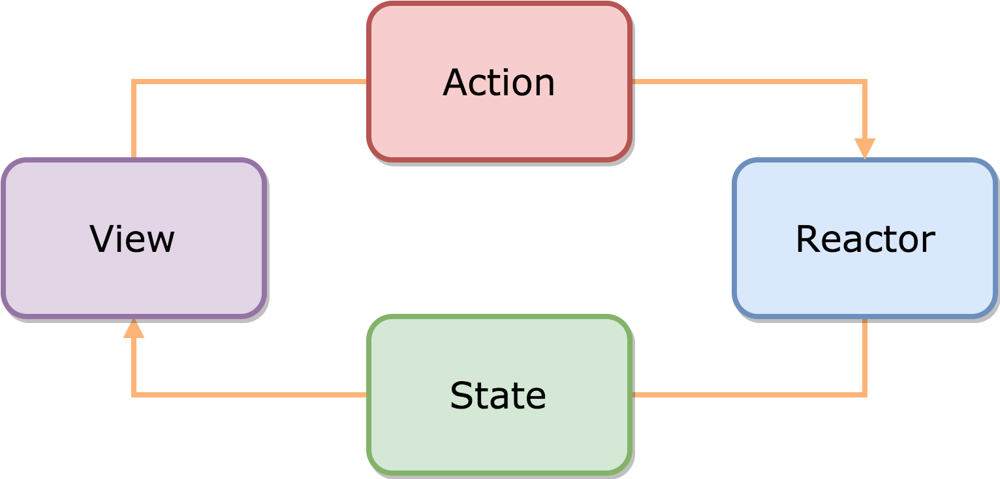

# OpenNews

[Mock API](https://mockapi.io) 를 활용한 뉴스 앱 제작

# Frameworks

- [RxSwift](https://github.com/ReactiveX/RxSwift) 를 기반으로 하며 [ReactorKit](https://github.com/ReactorKit/ReactorKit) 프레임워크를 사용합니다.
- [SnapKit](https://github.com/SnapKit/SnapKit) 을 활용한 Auto Layout 으로 UI 를 구성합니다.
- [RxAlamofire](https://github.com/RxSwiftCommunity/RxAlamofire) 를 사용해서 REST API 를 연동합니다.
- [RxDataSources](https://github.com/RxSwiftCommunity/RxDataSources) 를 사용한 Table or Collection 뷰를 구현합니다.

## ReactorKit

> View 와 비즈니스 로직을 분리할 수 있으므로 코드가 간결해지며, Testable & Reusable 한 코드 작성이 쉬워진다.
> 

- 단방향 데이터 흐름
- 표준이 없는 MVVM 패턴의 단점을 보완
